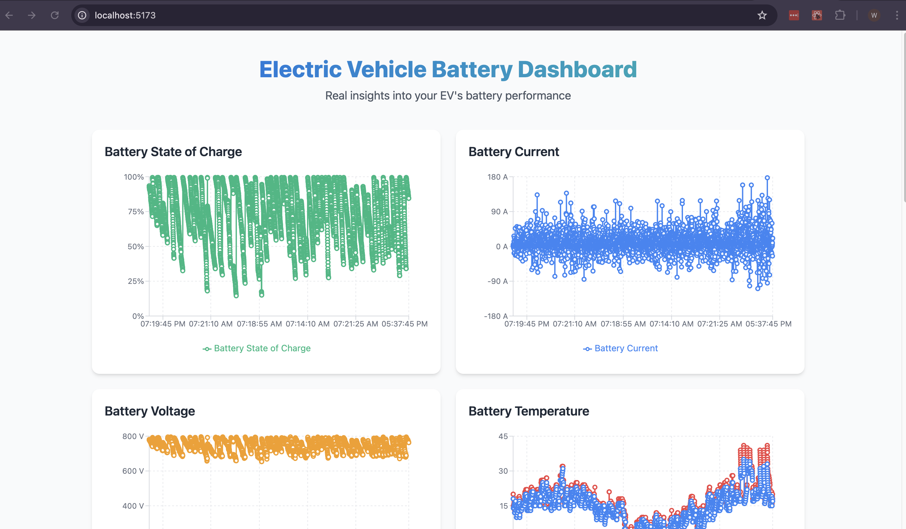

# EV Battery Dashboard (WIP)



A simple modern web application to visualize electric vehicle (EV) battery performance metrics, including State of Charge, Battery Current, Voltage, Temperature, Cell Voltages, State of Health, Speed, Acceleration, and Altitude. Built with React, TypeScript, Vite, Tailwind CSS, and Recharts, with a Work In Progress optional Flask backend for dynamic data serving.

---

## Table of Contents

- [Features](#features)
- [Tech Stack](#tech-stack)
- [Prerequisites](#prerequisites)
- [Installation](#installation)
- [Usage](#usage)
- [Optimizations](#optimizations)
- [Project Structure](#project-structure)
- [Contributing](#contributing)
- [License](#license)

---

## Features

- **Real-Time Visualization**: Interactive charts for battery metrics using Recharts.
- **Responsive Design**: Styled with Tailwind CSS for a polished, mobile-friendly UI.
- **Efficient Data Loading**: Lazy loading and compression for large datasets.
- **Optional Backend**: Flask backend to serve paginated data dynamically.
- **Type-Safe**: Built with TypeScript for robust development.

---

## Tech Stack

- **Frontend**:
  - React 18.3.1
  - TypeScript 5.6.3
  - Vite 5.4.8
  - Tailwind CSS 3.4.14
  - Recharts 2.15.2
- **Backend (Optional)**:
  - Flask (Python)
  - Pandas
- **Tools**:
  - ESLint for linting
  - PostCSS and Autoprefixer for CSS processing

---

## Prerequisites

- **Node.js** (>= 16.x recommended)
- **npm** (>= 8.x recommended)
- **Python** (>= 3.8, if using the Flask backend)
- **pip** (for Python dependencies)

---

## Installation

### Clone the Repository

```bash
git clone https://github.com/wesleygeorge/EV-dbc-App.git
cd ev-dbc-app
```

### Frontend Setup

1. **Install Dependencies**:
   ```bash
   npm install
   ```

2. **Prepare Data**:
   - Place your `battery_data.json` file in the `public/` folder. This file should contain the EV battery data in the format generated by the provided Python script.

3. **Run the Development Server**:
   ```bash
   npm run dev
   ```
   - Open `http://localhost:5173` to view the dashboard.

### (WIP) Optional Backend Setup (Flask)

If you prefer to serve data dynamically instead of using a static JSON file:

1. **Install Python Dependencies**:
   ```bash
   pip install flask flask-cors pandas
   ```

2. **Prepare Data**:
   - Place your `decoded_ev6_data_full.csv` file in a `data/` folder in the project root.

3. **Run the Flask Server**:
   ```bash
   python app.py
   ```
   - The Flask server will run on `http://localhost:5000`.

4. **Update Frontend to Use Backend**:
   - In `src/components/Dashboard.tsx`, update the `fetchData` function to fetch from the Flask endpoint:
     ```tsx
     const response = await fetch('http://localhost:5000/api/battery-data');
     ```

---

## Usage

- **View Dashboard**: Open `http://localhost:5173` after starting the Vite dev server.
- **Interact with Charts**: Hover over data points to see tooltips with detailed values.
- **Load More Data**: Click the "Load More Data" button to fetch additional data chunks (lazy loading WIP).
- **Dynamic Data (Optional)**: Use the Flask backend to filter data by time range or metrics. (WIP)

### Example Data
The dashboard expects data in the following format (from `battery_data.json` or Flask API):

```json
[
  {
    "TimeStamp": "2023-04-05T12:34:56",
    "StateOfChargeBMS": 75.5,
    "BatteryCurrent": -10.2,
    "BatteryDCVoltage": 350.0,
    "BatteryMaxTemperature": 35.0,
    "BatteryMinTemperature": 30.0,
    "MaxCellVoltage": 4.2,
    "MinCellVoltage": 3.8,
    "StateOfHealth": 98.5,
    "Speed": 60.0,
    "AccelerationX": 0.1,
    "AccelerationY": -0.2,
    "AccelerationZ": 9.8,
    "Altitude": 150.0
  },
  // ... more data points
]
```

---

## Optimizations (WIP)

To handle the large `battery_data.json` file (5MB), the following optimizations are implemented:

- **Lazy Loading**: Loads data in chunks (100 rows at a time) to reduce initial load time.
- **Compression**: Uses `vite-plugin-compression` to serve `battery_data.json` as a gzipped file, reducing its size.
- **Optional Backend**: The Flask backend can serve paginated or filtered data, further improving performance.

To enable compression:
```bash
npm install -D vite-plugin-compression
```
Update `vite.config.ts`:
```ts
import { defineConfig } from 'vite';
import react from '@vitejs/plugin-react';
import compression from 'vite-plugin-compression';

export default defineConfig({
  plugins: [
    react(),
    compression({ algorithm: 'gzip' }),
  ],
});
```

---

## Project Structure

```
ev-dbc-app/
├── data/                    # (Optional) CSV data for Flask backend
│   └── decoded_ev6_data_full.csv
├── public/                  # Static files
│   └── battery_data.json
├── src/                     # Frontend source code
│   ├── components/
│   │   ├── Dashboard.tsx    # Main dashboard component
│   │   ├── LineChart.tsx    # Single-line chart component
│   │   ├── MultiLineChart.tsx # Multi-line chart component
│   ├── types/
│   │   ├── BatteryData.ts   # TypeScript interface for battery data
│   ├── App.tsx              # App entry point
│   ├── main.tsx             # React entry point
│   ├── index.css            # Tailwind CSS styles
├── app.py                   # (Optional) Flask backend
├── package.json             # Node.js dependencies
├── tailwind.config.js       # Tailwind CSS configuration
├── postcss.config.js        # PostCSS configuration
├── vite.config.ts           # Vite configuration
└── README.md                # Project documentation
```

---

## Contributing

Contributions are welcome! To contribute:

1. Fork the repository.
2. Create a new branch (`git checkout -b feature/your-feature`).
3. Make your changes.
4. Commit your changes (`git commit -m "Add your feature"`).
5. Push to the branch (`git push origin feature/your-feature`).
6. Open a Pull Request.

Please ensure your code follows the project’s linting rules (`npm run lint`).

---

## License

This project is licensed under the MIT License.
